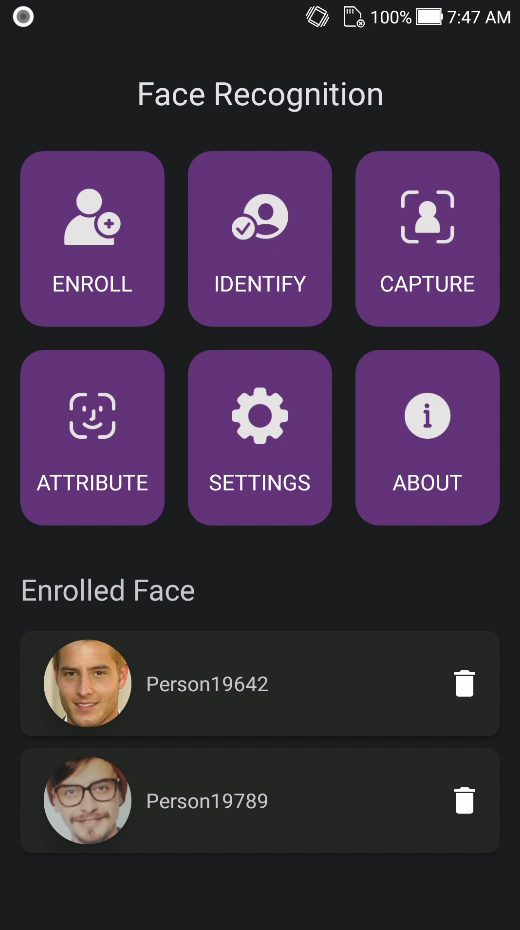
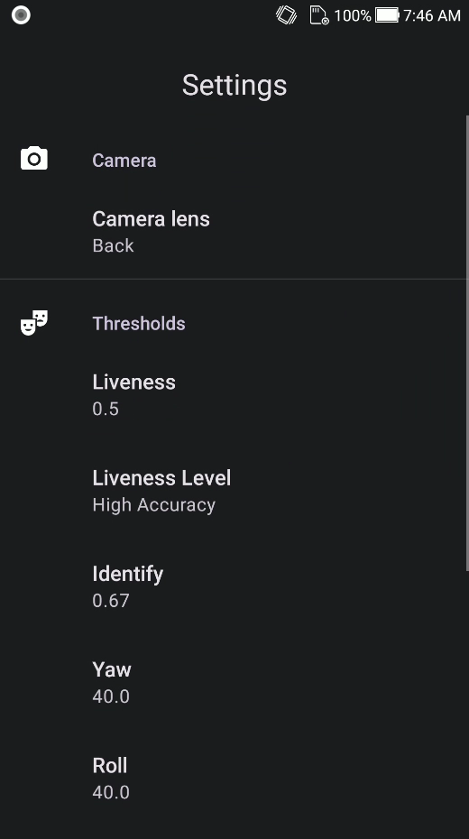
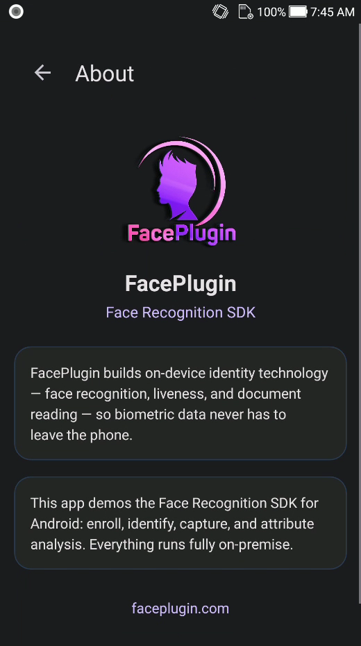

<div align="center">

</div>

#### 🌐 Company Site - [Here](https://faceplugin.com)
#### 🤗 Hugging Face - [Here](https://huggingface.co/FacePlugin-Ltd)
#### 🛟 Help Center - [Here](https://doc.faceplugin.com)
#### 🐳 Docker Hub - [Here](https://hub.docker.com/u/faceplugin)

# FacePlugin Face Recognition SDK — Ionic Cordova (Fully On-Premise)

> Drop Android AAR + iOS frameworks → add `./FacePlugin` → run on a **physical** phone.
> Jump: [Quick Start](#quick-start) · [Get the runtimes](#get-the-runtimes) · [Run the demo](#run-the-demo) · [Setup](#setup-on-your-own-app)


## Quick Start

**Prerequisites:** Node **18+**, **npm**, Cordova CLI (`npx cordova` is enough), **JDK 17**, Android SDK. iOS: **macOS + Xcode 15+**, physical iPhone. Put your Apple **Team ID** in root `build.json`.

Gradle is bootstrapped via `scripts/with-gradle.js` (no manual `GRADLE_HOME` for deploy).

### Android

```bash
git clone https://github.com/Faceplugin-ltd/FaceRecognition-Ionic-Cordova.git
cd FaceRecognition-Ionic-Cordova
npm install
# place FacePlugin/src/android/facerecognitionsdk.aar
npm run setup:android
npm run android
```


### iOS (macOS)

```bash
git clone https://github.com/Faceplugin-ltd/FaceRecognition-Ionic-Cordova.git
cd FaceRecognition-Ionic-Cordova
npm install
# place FacePlugin/src/ios/Frameworks/{facerecognitionsdk,FaceRecognitionEngine,onnxruntime}.framework
# edit build.json → ios.debug.developmentTeam = your Team ID (cert OU)
npm run setup:ios
npm run ios
```

> **Windows:** do not add the iOS platform. Add iOS only on macOS after placing the frameworks.


## Introduction

FacePlugin **Face Recognition SDK for Ionic Cordova** is a fully on-device biometric plugin for Android and iOS. Enroll faces, identify in 1:N with VideoWorker, capture with an oval coach, and read attributes with 2D liveness — all on the phone. Plugin id: `face-recognition-cordova`. On-premise — **no** biometric data leaves the device. Built for KYC, eKYC, and hybrid mobile onboarding.


| Folder          | Purpose                                                  |
| --------------- | -------------------------------------------------------- |
| Repository root | Ionic React demo (`config.xml`, `src/`, `www/`)          |
| `FacePlugin/`   | Cordova plugin (`ionic cordova plugin add ./FacePlugin`) |


Native binaries are **not** on GitHub. Download from Google Drive (links below).

### Main Functionalities


| Feature                                    | Supported |
| ------------------------------------------ | --------- |
| Face detection / landmarks                 | ✓         |
| Face recognition (enroll + 1:N identify)       | ✓         |
| 2D liveness / anti-spoofing                | ✓         |
| Live identify (VideoWorker)                | ✓         |
| Oval capture coach                         | ✓         |
| Attributes (age, gender, emotion, quality) | ✓         |


### Product List

| Platform | Repository |
|----------|------------|
| Android (Recognition) | [FaceRecognition-Android](https://github.com/Faceplugin-ltd/FaceRecognition-Android) |
| iOS (Recognition) | [FaceRecognition-iOS](https://github.com/Faceplugin-ltd/FaceRecognition-iOS) |
| React Native (Recognition) | [FaceRecognition-React-Native](https://github.com/Faceplugin-ltd/FaceRecognition-React-Native) |
| Flutter (Recognition) | [FaceRecognition-Flutter](https://github.com/Faceplugin-ltd/FaceRecognition-Flutter) |
| Ionic Capacitor (Recognition) | [FaceRecognition-Ionic-Capacitor](https://github.com/Faceplugin-ltd/FaceRecognition-Ionic-Capacitor) |
| **Ionic Cordova (Recognition)** | **[FaceRecognition-Ionic-Cordova](https://github.com/Faceplugin-ltd/FaceRecognition-Ionic-Cordova)** (**this repo**) |
| Windows (Recognition) | [FaceRecognition-Windows](https://github.com/Faceplugin-ltd/FaceRecognition-Windows) |
| Linux / Docker (Recognition) | [FaceRecognition-Docker](https://github.com/Faceplugin-ltd/FaceRecognition-Docker) |
| Android (Liveness) | [FaceLivenessDetection-Android](https://github.com/Faceplugin-ltd/FaceLivenessDetection-Android) |
| iOS (Liveness) | [FaceLivenessDetection-iOS](https://github.com/Faceplugin-ltd/FaceLivenessDetection-iOS) |
| Windows (Liveness) | [FaceLivenessDetection-Windows](https://github.com/Faceplugin-ltd/FaceLivenessDetection-Windows) |
| Linux / Docker (Liveness) | [FaceLivenessDetection-Docker](https://github.com/Faceplugin-ltd/FaceLivenessDetection-Docker) |


---


## Before you start


| Step | What you need                                                            |
| ---- | ------------------------------------------------------------------------ |
| 1    | Node.js 18+, npm, Ionic CLI, Cordova CLI                                 |
| 2    | Physical device recommended                                              |
| 3    | Android AAR + iOS frameworks — [Get the runtimes](#get-the-runtimes)     |
| 4    | Demo license in `src/license.ts` for `com.faceplugin.facerecognitionsdk` |


### System requirements


| Item   | Android                           | iOS             |
| ------ | --------------------------------- | --------------- |
| OS     | API 24 min                        | 13.0 min        |
| Device | Physical phone                    | Physical iPhone |
| Stack  | Cordova + Ionic React (repo root) | Same            |
| Build  | JDK 17                            | Xcode 15+       |


---


## Get the runtimes


### Android — `facerecognitionsdk.aar`

**Download:** [Google Drive — Android](https://drive.google.com/drive/folders/1kpzYVv9Gbm_pEpDe9-x7FGB4NWZzvez0)

| File                     | Path                                            |
| ------------------------ | ----------------------------------------------- |
| `facerecognitionsdk.aar` | `FacePlugin/src/android/facerecognitionsdk.aar` |

### iOS frameworks

**Download:** [Google Drive — iOS](https://drive.google.com/drive/folders/1PKmV-o7gq7s7dDtiNgXPfCi2ZlWaRy5H)

Place under `FacePlugin/src/ios/Frameworks/`:

- `facerecognitionsdk.framework`
- `FaceRecognitionEngine.framework`
- `onnxruntime.framework`


---


## Run the demo

```bash
git clone https://github.com/Faceplugin-ltd/FaceRecognition-Ionic-Cordova.git
cd FaceRecognition-Ionic-Cordova
npm install
# place facerecognitionsdk.aar (and iOS frameworks on macOS) as above
npm run setup:android   # Android
npm run android
```

**iOS (macOS only):**

```bash
# set developmentTeam in build.json first
npm run setup:ios
npm run ios
```

Team ID = certificate **OU** (not the id after your email in Keychain). Free Apple IDs are limited to a few simultaneous apps (`0xe8008021` → delete unused free-dev apps on the phone).

### Use the demo

1. Wait for home status → **Ready**.
2. **Enroll**, **Identify**, **Capture**, **Attribute**, **Settings**, and **About** — on-device 1:N matching, oval capture, attributes, and 2D liveness.


| Platform      | Identifier                          |
| ------------- | ----------------------------------- |
| Android / iOS | `com.faceplugin.facerecognitionsdk` |


### Screenshots

| Home | Identify | Capture |
| ---- | -------- | ------- |
| <p align="center"></p> | <p align="center"></p> | <p align="center"></p> |

| Capture result | Attribute | Attribute (emotion) |
| -------------- | --------- | ------------------- |
| <p align="center"></p> | <p align="center"></p> | <p align="center"></p> |

| Attribute (quality) | Settings | About |
| ------------------- | -------- | ----- |
| <p align="center"></p> | <p align="center"></p> | <p align="center"></p> |

| Home (tiles) | Attribute (liveness) |
| ------------ | -------------------- |
| <p align="center"></p> | <p align="center"></p> |

---

## SDK License

Licenses are **offline** and bound to your `applicationId` / bundle identifier.

The sample app already includes a valid key for `com.faceplugin.facerecognitionsdk`. You only need a new key if you use a different id.

### How to get a license

The code below shows how to use the license:

[https://github.com/Faceplugin-ltd/FaceRecognition-Ionic-Cordova/blob/0cf8e0de7a1d5c58ac9176b7a2b5d6190bc1dd1e/src/license.ts#L7-L15](https://github.com/Faceplugin-ltd/FaceRecognition-Ionic-Cordova/blob/0cf8e0de7a1d5c58ac9176b7a2b5d6190bc1dd1e/src/license.ts#L7-L15)

[https://github.com/Faceplugin-ltd/FaceRecognition-Ionic-Cordova/blob/0cf8e0de7a1d5c58ac9176b7a2b5d6190bc1dd1e/src/SdkContext.tsx#L63-L73](https://github.com/Faceplugin-ltd/FaceRecognition-Ionic-Cordova/blob/0cf8e0de7a1d5c58ac9176b7a2b5d6190bc1dd1e/src/SdkContext.tsx#L63-L73)

Please [contact us](#contact) to get a license for **your own app**.

---


## Setup on your own app

```bash
ionic cordova plugin add ./FacePlugin
```

Place `facerecognitionsdk.aar` at `FacePlugin/src/android/facerecognitionsdk.aar` before adding the plugin.

Enable Kotlin in `config.xml`:

```xml
<preference name="GradlePluginKotlinEnabled" value="true" />
<preference name="GradlePluginKotlinVersion" value="1.9.24" />
<preference name="AndroidXEnabled" value="true" />
```

TypeScript API package name: `face-recognition-cordova` (`file:FacePlugin`).

---

## Contact

<div align="left">
<a target="_blank" href="mailto:info@faceplugin.com"></a>&emsp;
<a target="_blank" href="https://wa.me/+14692784822"></a>
</div>

